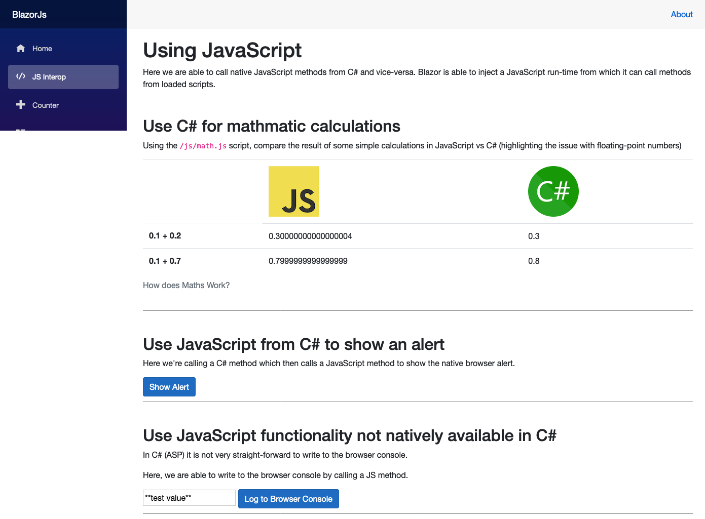

# BlazorJs

An app developed using the new Blazor WebAssembly (client-side) to demonstrate how it works and how to use it with native JavaScript.

## Background

This has been built largely from the default 'hello world' app as documented at [Get started with ASP.NET Core Blazor](https://docs.microsoft.com/en-us/aspnet/core/blazor/get-started?view=aspnetcore-3.1&tabs=visual-studio-code).

I extended this by adding a `Js` page with examples of how we can use C# and JavaScript together.

  

## Usage

1. Install the latest version of [.NET Core SDK](https://dotnet.microsoft.com/download/dotnet-core/3.1).
2. At the terminal, you should now be able to build and run this application by calling `dotnet run`.
3. Navigate to [http://localhost:5000](http://localhost:5000) in your favourite browser (as long as it isn't IE [IE does not support WebAssembly]).
